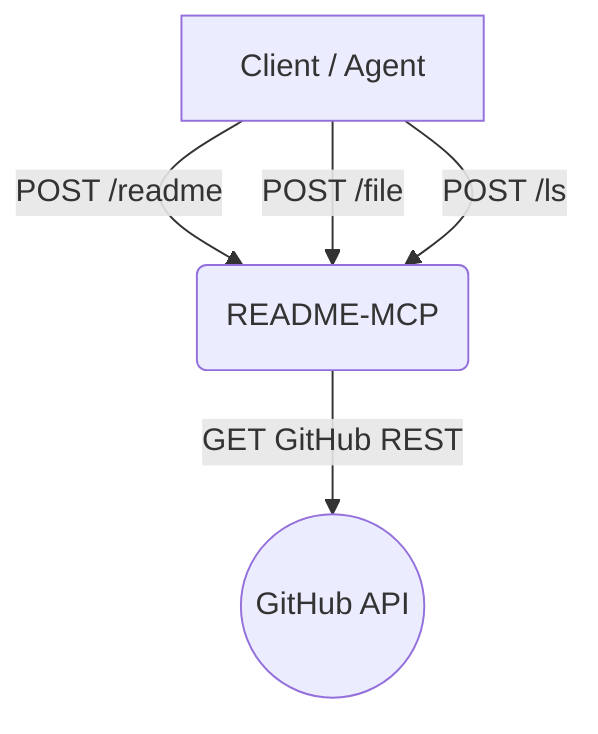

# DEVELOPMENT.md

## Overview

This document lays out the development plan for README-MCP, a minimal service that exposes three deterministic endpoints — `/readme`, `/file`, `/ls` — for agents to retrieve a GitHub repository’s README and any referenced example files.

## Goals

* Provide ground‑truth documentation and code to AI agents with zero LLM tokens.
* Keep the service stateless, cache‑friendly, and easy to port across runtimes.
* Support public GitHub repositories.

## Functional Requirements

1. **/readme** – Return the decoded README at repo root.
2. **/file** – Return raw bytes of a single in‑repo file.
3. **/ls** – List immediate children of a directory.

## Non‑Goals

* No embedding, summarisation, or syntax analysis.
* No write operations to GitHub.

## Architecture



### Internal Components

| Component        | Responsibility                                                   |
| ---------------- | ---------------------------------------------------------------- |
| **Router**       | Validate request & auth, route to handler                        |
| **GitHubClient** | Thin wrapper around GitHub REST `contents` and `trees` endpoints |
| **Cache**        | Keyed by `repo@sha+path`, stores body + ETag                     |
| **Limiter**      | Mirrors GitHub rate‑limit headers to caller                      |

## Tech Stack

* **Runtime**: Python 3.12 + FastAPI + Uvicorn
* **HTTP client**: `httpx` with retry & timeout middleware
* **Cache**: Redis (optional Cloudflare KV when serverless)
* **Testing**: PyTest + VCR.py to record GitHub fixtures
* **CI/CD**: GitHub Actions → Docker → DigitalOcean

## API Design

See `openapi.yaml` for the full spec. Key snippets:

### /readme

```yaml
POST /readme
Request:  { repo_url, ref?, token? }
Response: { content, sha, etag }
```

### /file

```yaml
POST /file
Request:  { repo_url, path, ref?, token? }
Response: { path, language, content, sha, etag }
```

### /ls

```yaml
POST /ls
Request:  { repo_url, dir, ref?, token? }
Response: { entries:[{path,type,size}], sha, etag }
```

## Development Phases

| Phase | Timeline  | Deliverables                                     |
| ----- | --------- | ------------------------------------------------ |
| 0     | Day 0–1   | Repo bootstrap, lint, CI skeleton                |
| 1     | Day 2–4   | `/readme` handler + unit tests                   |
| 2     | Day 5–7   | `/file` handler + size & path guards             |
| 3     | Day 8–10  | `/ls` handler + directory parsing                |
| 4     | Day 11–12 | Shared caching layer & ETag support              |
| 5     | Day 13–14 | Integration tests against public repos           |
| 6     | Day 15    | Deploy to staging, load test                     |
| 7     | Day 16    | Production cut‑over & tag v1.0.0                 |

## Testing Strategy

* **Unit**: Mock GitHub responses with VCR.py.
* **Integration**: Hit real public repos (e.g. `pallets/flask`) in CI.
* **Contract**: Dredd tests to verify OpenAPI schema.
* **Load**: k6 script simulating 500 rps, ensure <200 ms p95.

## Security Considerations

* Validate `repo_url` against regex `^https://github.com/{owner}/{repo}$`.
* Strip `..` and symlink elements in `path` and `dir`.
* Enforce 100 kB max file size and 1 000 entry max per listing.
* Forward GitHub `X-RateLimit-*` headers to client.

## Deployment

1. `docker build -t readme-mcp:$(git rev-parse --short HEAD) .`
2. `doctl apps create-deployment --spec .do/app.yaml`
3. Verify health check `/alive` returns 200.

## Future Enhancements

* Support private GitHub repositories (via Personal Access Token).
* Support GitLab & Bitbucket via adapter pattern.
* Optional `recurse` flag for deep directory listings.
* Webhook to push cache invalidations on new commits.

---

**Contact**: Huguet57 on GitHub or andreuhuguet@gmail.com

